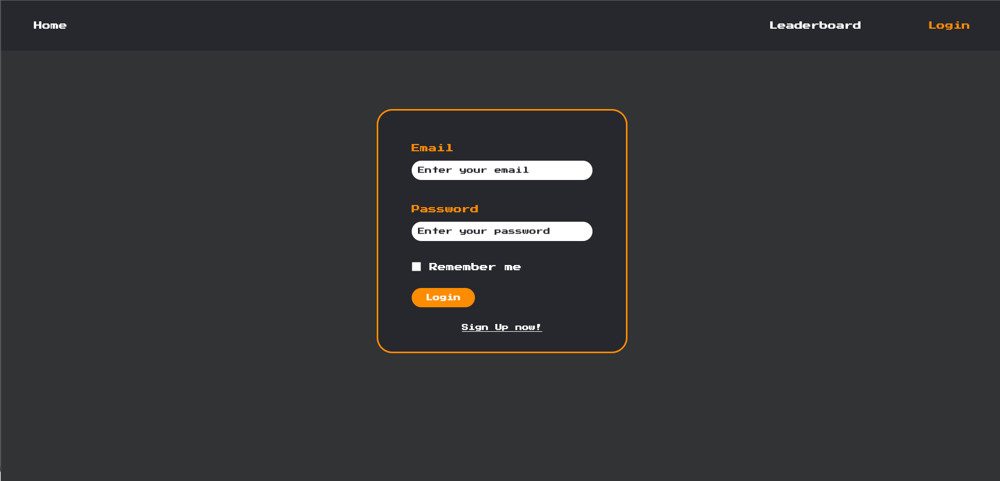
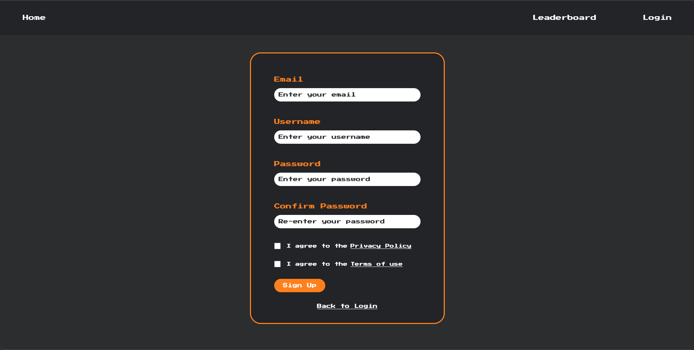
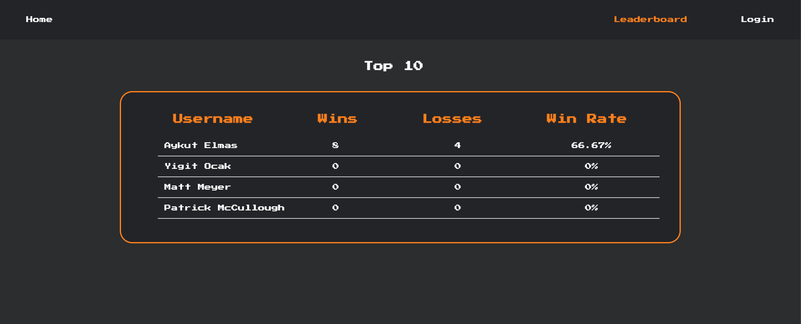
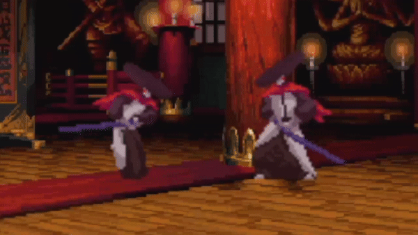
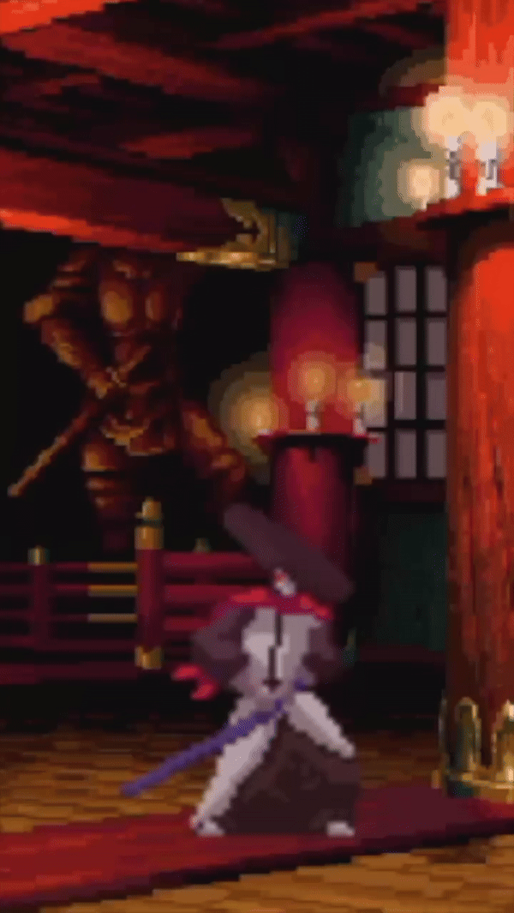
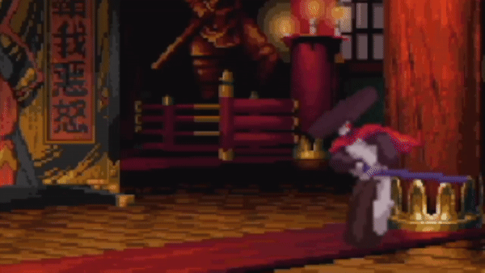
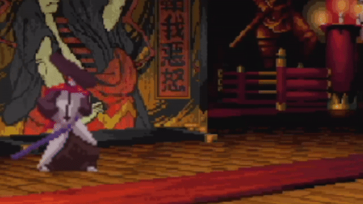

# [Pixel Punch-Out](https://pixel-punch-4k5zl2c7o-yigitocaks-projects.vercel.app/)

## Overview

**Pixel Punch-Out** is a multiplayer web platform fighting game that allows players to engage in combat with friends. Players can create and join rooms, select from various arenas. The game features a token-based authentication system for secure sign-up and login processes.

## Problem

There aren't many options for multiplayer fighting games that you can play right from your web browser — most of the good ones need you to download big files or have a fancy gaming setup. **Pixel Punch-Out** fills this void by being super accessible. It's a fun, straightforward game that anyone with a browser can jump into, no heavy downloads or high-end hardware needed. This means more people can get into the gaming action with friends without any hassle.

## User Profile

**Pixel Punch-Out** is designed for young to middle-aged gamers looking for a fun and engaging multiplayer experience. This game appeals to both casual gamers who want a quick and enjoyable match with friends and more competitive players who enjoy mastering fighting games. Users can easily set up a game room, and start fighting within minutes, making it ideal for those who value convenience and fast gameplay. The simple browser-based access ensures that anyone with internet access can join in the fun, regardless of their hardware capabilities.

## Features

- **Room Creation and Joining:** Players can easily create or join game rooms, allowing for private matches with friends or open games with others online.
- **Arena Selection:** When setting up a game room, players can select from a variety of arenas, each with unique aesthetics.
- **Real-time Multiplayer Combat:** The game will support seamless, real-time fights, ensuring a dynamic and engaging player experience.
- **Token-based Authentication System:** Secure sign-up and login processes will be implemented, ensuring player accounts are protected.

## Implementation

### Tech Stack

- **Frontend:** React for building the interactive user interface elements.
- **Backend:** Node.js with Express for managing game logic, room management, and player interactions in real-time.
- **Database:** MySQL for storing user data. Chosen for its reliability and support for complex queries, ideal for transactional requirements.
- **Authentication:** JSON Web Tokens (JWT) for secure, token-based user authentication.
- **Websockets:** Socket.IO for real-time bi-directional communication between clients and servers, essential for a seamless multiplayer experience.

## Mockups

Currently, I don't have in game screenshots, but I did create the logo, login, signup, and the leaderboard for the game.
 
#### Logo

#### Login

#### Sign Up

#### Leaderboard

#### In-game Content

  

## Data

**Pixel Punch-Out** will utilize a relational database structure with the following key entities:

- **User:** Stores information about players, including username, password (hashed), email, and game statistics like wins and losses.
- **Room:** Represents a game session, containing room ID, room name, arena selected.

#### Relationships:
- A **User** can create multiple **Rooms** and join many **Rooms**.
- Each **Room** hosts multiple **Users** and relates to one **Match** at a time.
- **Characters** are selected by **Users** in the **Rooms** for each game session.

This structure supports efficient data retrieval and updates necessary for real-time gameplay and user management.

## Endpoints

- **POST /login:** Allows users to log in to the game.
    - **Parameters:** `username`, `password`
    - **Response:** `{ token: "JWT", userId: "123", success: true }`

- **POST /signup:** Registers a new user.
    - **Parameters:** `username`, `email`, `password`
    - **Response:** `{ userId: "123", success: true }`

- **GET /rooms:** Retrieves a list of active game rooms.
    - **Parameters:** None
    - **Response:** `{ rooms: [{ roomId: "456", roomName: "Battle Arena", status: "waiting" }], success: true }`

- **POST /rooms/create:** Allows a user to create a new game room.
    - **Parameters:** `userId`, `roomName`, `arenaId`
    - **Response:** `{ roomId: "789", success: true }`

- **POST /rooms/join:** Allows a user to join an existing room.
    - **Parameters:** `roomId`, `userId`
    - **Response:** `{ roomId: "789", userId: "123", success: true }`

- **GET /profile/:userId:** Fetches profile details of a user.
    - **Parameters:** `userId`
    - **Response:** `{ username: "PlayerOne", wins: 10, losses: 5, success: true }`

## Auth

**Pixel Punch-Out** implements a secure token-based authentication system using JSON Web Tokens (JWT). This system ensures that all user interactions with the game are authenticated and authorized appropriately.

- **User Authentication:** Users must log in to access their profiles and join or create game rooms. Upon successful login, a JWT is generated and sent to the user. This token must be included in the header of all authenticated requests to verify the user's identity.
- **Session Management:** The JWT contains the user's ID and an expiration time, ensuring sessions are secure and temporary. The token automatically expires after a set duration, requiring re-authentication.
- **Security Measures:** Passwords are hashed before storage in the database to protect user privacy and security.

## Roadmap

The development of **Pixel Punch-Out** is organized into an intense 2-week sprint focusing on delivering a playable game first, followed by backend functionalities:

### Week 1: Core Game Development
- **Goals:**
    - Set up the project repository and configure the tech stack.
    - Develop the core game mechanics.
    - Implement character and arena selection functionalities.
    - Start front-end UI development for game.

### Week 2: Backend Integration and Launch
- **Goals:**
    - Implement backend functionalities using Node.js and Express, including room management and user authentication.
    - Integrate real-time communication capabilities with Socket.IO.
    - Finalize the UI integration with the backend.
    - Conduct rapid testing across different scenarios and perform debugging.
    - Deploy the project for public access and perform last-minute optimizations.

**Note:** The focus will be on creating a Minimum Viable Product (MVP) that allows for basic playability and user interaction. Additional features and refinements may be planned for future updates based on initial user feedback and project evaluation.

**Nice to have:** Lives section, character selection, and character abilities.
